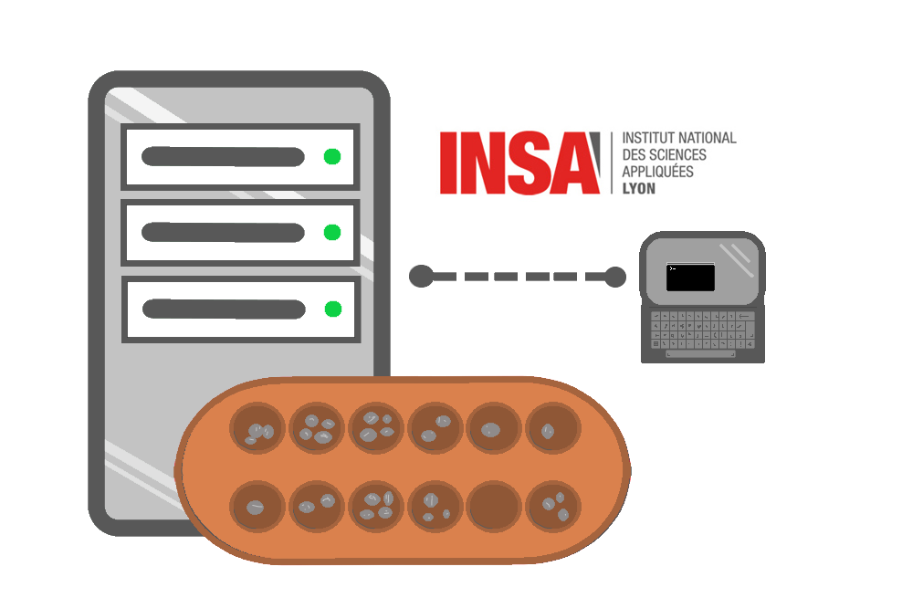

<h1 align="center" id="readme-top">Serveur de Jeu AWALE en C</h1>
<!-- PROJECT LOGO -->
<br />
<div align="center">
    
  <br />

  

  <p align="center"><br />
    Code pour mettre un place un serveur de jeu Awale se bassant sur des sockets.
    <br /> Fournit à la fois le code pour le serveur et le client.
    <br> Persistance non implementée.
    <br /> <a href = "https://fr.wikipedia.org/wiki/Awal%C3%A9">Page wikipédia du jeu AWALE »</a>
    <br /> ---------------------------------------
    <br />
    Projet pour l'<a href="https://www.insa-lyon.fr/fr">INSA</a> 4IF
    <br /> [Intitut National des Sciences Appliquées des Lyon]
    <br /> <a href = "https://if.insa-lyon.fr/fr/rubrique/departement-informatique"> Département Informatique »</a>
    <br /><br /><br />

  </p>
</div>


<center>
  <span style="font-size: 20px;">Contributeurs</span>

|  |  |
| ---------- | ---------- |
|  [ <br /><sub><center><a href="https://github.com/Diego-LarrazM">Diego-LarrazM</a></center></sub>](https://github.com/Diego-LarrazM/Programmation-d-un-serveur-de-Jeu-Awale)   | [ <br /><sub><center><a href="https://github.com/hary42">hary42</a></center></sub>](https://github.com/Diego-LarrazM/Programmation-d-un-serveur-de-Jeu-Awale)   |

</center>


<!-- TABLE OF CONTENTS -->
<details>
  <summary>Table of Contents</summary>
  <ol>
    <li>
      <a href="#about-the-project">About The Project</a>
      <ul>
        <li><a href="#built-with">Built With</a></li>
      </ul>
    </li>
    <li>
      <a href="#getting-started">Getting Started</a>
      <ul>
        <li><a href="#prerequisites">Prerequisites</a></li>
        <li><a href="#installation">Installation</a></li>
      </ul>
    </li>
    <li><a href="#usage">Usage</a></li>
    <li><a href="#roadmap">Roadmap</a></li>
    <li><a href="#contributing">Contributing</a></li>
    <li><a href="#license">License</a></li>
    <li><a href="#contact">Contact</a></li>
    <li><a href="#acknowledgments">Acknowledgments</a></li>
  </ol>
</details>


<!-- À PROPOS DU PROJET -->
## 1 - [❓]  À Propos du Projet

⚠️ <span style="color:orange;">Le projet a été préparé pour être compilé sous **linux**</span>.

Ce projet fournit une application client/serveur qui permettent aux clients de jouer des parties, de vérifier que les règles sont biens appliquées et de communiquer.<br/>
Les joueurs peuvent de même se démander en amitié et privatiser leur parties, voir les joueurs ou parties actives et de les observer. <br/>
Ils se connectent avec un mot de passe et un pseudo qui permet de les identifier.

### 🖥 Coté Serveur >
Le script `/Server/server.c` permet de lancer un serveur connecté au `PORT` défini sur `Libraires/network.h` (égal à 1977 par défaut) et à l'adresse IP `IP_Serv` de l'ordinateur qui a lancé le script. <br/>
L'ordinateur qui lancera le script se comportera comme le serveur en attendant des requêtes de la part des utilisateurs avec un socket ouvert. <br/> Une fois un client connecté il créera une nouvelle socket pour ce client sur laquelle ils pourront communiquer.<br/> Par la suite, il répondra à leurs démandes en fonction du bésoin défini sur chaque requête.

### 💻 Coté Client >
Le script `/Client/client.c` permet à l'ordinateur qui lance ce script de se connecter au socket sur `IP_Serv` et `PORT` du serveur et d'y communiquer en lançant des requêtes grâce à des commandes sur le terminal<br/>
Les réponses du serveur seront affichées tout de même sur ce terminal.


<br/><br/><br/>

## 2 - [ 📖 ]   Dépendances (librairies)

Voici la liste des librairies utilisées:
### Fournies sur ce git >
```c
Libraries/Awale/awale.h // fonctionnement du jeu
Libraries/request.h     // structures des requêtes et leur signature
Libraries/network.h     // paramètres (constantes) et librairies nécessaires au fonctionnement du serveur
```


### 🌐 Externes >
```c
<pthread.h>
<stdlib.h>
<stdio.h>
<time.h>
<errno.h>
<sys/types.h>
<sys/socket.h>
<netinet/in.h>
<arpa/inet.h>
<unistd.h>
<netdb.h>
<sys/select.h>
```


### ✨ Reccomandation >
Si ce projet est ouver avec Visual Studio Code, le projet est défini avec des regions permettant de plier des parties du code qui ne nous intéressent pas pour faciliter la lecture
grâçe à l'extension :<br/>

|  |  |
| ---------- | ---------- |
| [](https://marketplace.visualstudio.com/items?itemName=maptz.regionfolder) | <a href="https://marketplace.visualstudio.com/items?itemName=maptz.regionfolder"> "#region folding for VS Code" - par maptz »</a>.

```c
// #region X

...

// #endregion
```

<br/><br/>

<p align="right">(<a href="#readme-top">back to top</a>)</p>

<!-- LANCEMENT -->
## 3 - [ ⋆⭒˚.⋆🚀 ] Lancement

<span id = "configServ"></span>

### 🔧 Configuration >
Dans `Libraries/network.h` vous trouverez des constantes permettant de configurer des paramètres serveur (region `Server parameters`) que vous pouvez changer:

```c
// #region Server parameters //

#define CRLF "\r\n"                                           // Char pour saut de ligne ajouté aux messages
#define PORT 1977                                             // Port utilisé du serveur
#define MAX_CLIENTS 100                                       // Nombre maximal de clients connectés en même temps
#define MAX_OBSERVERS (MAX_CLIENTS - 2)                       // Nombre maximal d'observateurs d'un jeu

#define BUF_SIZE 1024                                         // Taille maximale des messages échangés entre client et serveur
#define MESSAGE_TIME_INTERVAL 1 // in milliseconds            // Temps ajouté entre chaque envoie de message pour éviter des erreurs d'envoie
#define STD_TIMEOUT_DURATION 30000 // in milliseconds         // Temps de timeout

#define MAX_PLAYER_COUNT 1024                                 // Nombre maximal de joueurs que le serveur peut enregistrer
#define MAX_FRIEND_COUNT MAX_PLAYER_COUNT                     // Nombre maximal de joueurs qu'un joueur peut ajouter en ami
#define MAX_NAME_SIZE 50                                      // Taille maximale du pseudo
#define MAX_PASSWORD_SIZE 50                                  // Taille maximale du mot de passe
#define MAX_BIO_SIZE 50                                       // Taille maximale de la BIO

// #endregion Server parameters
```


### </> Compilation >
Un fichier makefile est fourni pour réaliser la compilation. Il suffit de tapper au terminal sur le root de ce fichier git:<br/>
```bash
C:xx/PROGRAMATION-D-UN-SERVEUR-DE-JEU-AWALE> make
```

Cela viendra créer les fichiers *.o et les executables:
*  `client` dans le sous-dossier `Client/` 
*  `server` dans le sous-dossier `Server/`

<br/>

### 🖥 Lancement Coté Serveur >
Il suffit de lancer le serveur et le laisser tourner.
```bash
C:xx/PROGRAMATION-D-UN-SERVEUR-DE-JEU-AWALE> ./Server/server
__|
```
<br/>


### 💻 Lancement Coté Client >
Lors de la connexion client il est nécessaire d'indiquer l'addresse IP `IP_Serv` (ici `192.168.10.178`) de la machine sur laquelle le serveur a été lancé le serveur. <br/>
Il faut de même fournir le **pseudo** et **mot de passe** du client qui se connecte:
* **Lors de la première connexion**, le client sera enregistré comme un novueau joueur, avec son pseudo et mot de passe.
* **Lors de connexions ultérieures**, il faudra fournir son pseudo accompagné du même mot de passe fourni lors de la première connexion.
  
⚠️ Il n'est pas possible de se connecter avec le même pseudo sur deux terminaux/machines différents, ni de se connecter sans fournir le mot de passe du joueur.

#### -> Connexion réussie:
```bash
C:xx/PROGRAMATION-D-UN-SERVEUR-DE-JEU-AWALE> ./Client/client 192.168.10.178 pseudoJoueur motDePasse
Connected to the server

__|
```

#### -> Connexion échouée (exemple: mot de passe incorrect):
```bash
C:xx/PROGRAMATION-D-UN-SERVEUR-DE-JEU-AWALE> ./Client/client 192.168.10.178 pseudoJoueur mauvaisMotdePasse
Mot de passe incorrect.
C:xx/PROGRAMATION-D-UN-SERVEUR-DE-JEU-AWALE> __|
```
<br/><br/><br/>

<p align="right">(<a href="#readme-top">back to top</a>)</p>


<!-- COMMANDES CLIENT -->
## 4 - [ 📝-💻 ] Commandes client de base

Ici sont listées l'ensemble des fonctionalités réalisables par le client (sauf celles propres au jeu cf <a href ="#ComJeu">Commandes client pour Jouer</a>), des exemples d'utilisation et les commandes à taper.<br/>
⚠️ `[ENTER]` répresente la touche entrée frappée et `__|` le curseur.<br/>
⚠️ Nous suppossons que nous sommes déjà connectés au serveur.

### < ---------------- `/help` ou `/?` ----------------- >
Affiche toutes les commandes qui sont à la disposition du client.
* Exemple:
```
/help [ENTER]
/logout                              : to quit the server
/msg <player-name> <message-content> : to send a private message
/challenge <player-name> [private]   : to challenge a friend
/move <house-number>                 : to choose a move to play
/friend <player-name>                : to add a friend
/accept                              : to accept a request
/decline                             : to decline a request
/who [friend]                        : to see all online players or only you friends
/games [friend]                      : to see all active games or only your friend's games
/observe <player-name>               : to observe a friend's game
/quit                                : to quit observing a game

__|
```
<br/><br/>

### < ---------------- `/logout` ----------------- >
Déconnecte le client du serveur
* Exemple:
```
/logout [ENTER]
C:xx/PROGRAMATION-D-UN-SERVEUR-DE-JEU-AWALE> __|
```

<br/><br/>

### < ---------------- Envoie de message à tous les clients connectés ---------------- >
Sans commande. Juste en écrivant sur le terminal une fois connecté et appuyant sur ENTER, ce message sera envoyé à tous les clients connectés.
* Exemple :<br/>
  
*Pour Toto*
```
C:xx/PROGRAMATION-D-UN-SERVEUR-DE-JEU-AWALE> ./Client/client 192.168.10.178 Toto MotdePasse

Hello World ! [ENTER]
__|
```

*Pour les autres clients*
```

Toto: Hello World !
__|
```

<br/><br/>

### < ---------------- `/msg <pseudo-joueur> <message>` ----------------- >
Envoie un message à un joueur en particulieur en indiquant sont pseudo.
* Exemple : <br/>

*Pour Toto*
```
C:xx/PROGRAMATION-D-UN-SERVEUR-DE-JEU-AWALE> ./Client/client 192.168.10.178 Toto MotdePasse1

/msg Jojo Hey, ceci est un message secret. [ENTER]
__|
```

*Pour Jojo*
```
C:xx/PROGRAMATION-D-UN-SERVEUR-DE-JEU-AWALE> ./Client/client 192.168.10.178 Jojo MotdePasse2

Toto (whispers) : Hey, ceci est un message secret.
__|
```

<br/><br/>

### < ---------------- `/who [friend]` ----------------- >

⚠️ <span style ="color:orange;">Ne fait rien si nous sommes dans une partie ou en attendant/répondant à une démande d'amitié ou de challenge</span><br/>

Affiche la liste des joueurs connectés et leur état actuel.<br/>

Il y trois états possibles: `Ready` si nous pouvons lui proposer en ami ou le challenger, `In Game` si il est en train de joueur une partie non privée et `-` s'il est occupé.<br/>
Un joueur est occupé si il attends une réponse ou répond et s'il est dans une partie privée et vous n'êtes pas ami avec celui qui l'a lancé.

* Exemple : <br/>

*Pour Toto*
```
/who [ENTER]
<-- Active Player Name : State -->
Toto : -
Jojo : Ready
Nala : In Game
Narnia64 : In Game 

__|
```
<br/>

Si le drapeau `friend` est indiqué en plus, la liste va filtrer les joueurs dont nous sommes amis avec.
* Exemple : <br/>

*Pour Toto ami de Jojo*
```
/who friend [ENTER]
<-- Active Player Name : State -->
Jojo : Ready

__|
```

<br/><br/>

### < ---------------- `/games [friend]` ----------------- >

⚠️ <span style ="color:orange;">Ne fait rien si nous sommes dans une partie ou en attendant/répondant à une démande d'amitié ou de challenge</span><br/>

Affiche la liste des parties en cours publiques ou lancées par des amis.<br/>

* Exemple : <br/>

*Pour Toto*
```
/games [ENTER]
<-- Active Player Name : State -->
Nala vs Narnia64
_xz_ vs __pseudoCode__ 
__|
```
<br/>

Si le drapeau `friend` est indiqué en plus, la liste va filtrer les parties en cours lancées par des amis.
* Exemple : <br/>

*Pour Toto ami de Nala qui a lancé la partie*
```
/games friend [ENTER]
<-- Active Player Name : State -->
Nala vs Narnia64

__|
```

<br/><br/>

### < ---------------- `/friend <pseudo-joueur>` ----------------- >

⚠️ <span style ="color:orange;">Ne fait rien si nous sommes dans une partie ou en attendant/répondant à une démande d'amitié ou de challenge</span><br/>

Lance une démande en amitié envers le joueur indiqué.<br/>
⚠️ Le joueur à démander doit être conecté et non occupé.<br/>
⚠️ Il ne'est pas possible de s'ajouter soi-même en ami.<br/>
⚠️ Le démandeur et répondeur ne pourront rien faire en attendant la réponse<br/>
⚠️ Si le joueur ne réponds pas dans `STD_TIMEOUT_DURATION` (cf. <a href ="#configServ">configuration</a>), il y aura un timeout et la requête sera annulée.<br/>
⚠️ Si le joueur se déconnecte après avoir reçu une déamdne d'amitié, une fois reconnecté sa démande sera perdue.<br/>

* Exemple : <br/>

*Pour Toto*
```
/friend Narnia64 [ENTER]
Sent friend request.

__|
```

*Pour Narnia64*
```
Toto wants to be friends... /accept or /decline ?
__|
```

<br/><br/>

### < ---------------- `/accept` et `/decline` ----------------- >

⚠️ <span style ="color:orange;">Ne fait rien si auccune démande n'a été reálisée à ce joueur</span><br/>

Accepte ou decline une démande, que ce soit d'amitié ou challenge<br/>
Il n'est pas possible de faire autre chose que de répondre avec une de ces commandes une fois une démande réçue.<br/>
(⚠️ Protection contre SPAM de la part d'un client envers un autre non implementée).

* Exemple : <br/>

*Pour Narnia64*
```
You have received a friend request from Toto... /accept or /decline
/accept [ENTER]
Success: Friend added !

__|
```

*Pour Toto*
```
Success: Friend added !

__|
```

<br/><br/><br/>

<span id = "ComJeu"></span>

## 5 - [ 📝-🎮 ] Commandes client pour Jouer 

### < ---------------- `/challenge <pseudo-joueur> [private]` ----------------- >

⚠️ <span style ="color:orange;">Ne fait rien si nous sommes dans une partie ou en attendant/répondant à une démande d'amitié ou de challenge</span><br/>

Lance une démande envers le jouer indiqué pour lancer une partie d'AWALE ensemble.<br/>
⚠️ Le joueur à démander doit être conecté et non occupé.<br/>
⚠️ Il ne'est pas possible de se challenge soi-même.<br/>
⚠️ Le démandeur et répondeur ne pourront rien faire en attendant la réponse<br/>
⚠️ Si le joueur ne réponds pas dans `STD_TIMEOUT_DURATION` (cf. <a href ="#configServ">configuration</a>), il y aura un timeout et la requête sera annulée.<br/>
⚠️ Si le joueur se déconnecte après avoir reçu une déamdne d'amitié, une fois reconnecté sa démande sera perdue et le démandeur pourra continuer à faire des commandes sans dévoir attendre le timeout.<br/>

* Affichage du Jeu : <br/>
Sur le jeu seront affichés tout en haut le score de chaque jouer à chaque tour (e nnombre de graines récoltées).<br/>
Puis le palteau avec sur chaque case: le nom de la case et le nombre de graines sur cete case. <br/>
**Le sens du jeu est HORAIRE par défaut** (démontré par les flèches aux bords du plateau)<br/>
Chaque joueur est informé lorsqu'il est leur tour de jouer. Le joueur qui joue au premier tour est choisi aléatoirement.<br/>
Le jeu indique au joueur courant les cases qu'il peut choisir à jouer.
```
╔════Numero Case════╗        ╔═══════════════════╗
║ Nombre de graines ║   ou   ║ Nombre de graines ║
╚═══════════════════╝        ╚════Numero Case════╝ 
```

* Exemple : <br/>

#### \\_> Toto challenge Jojo (qui est `Ready`) à une partie, il accepte et la partie se lance.
*Pour Toto*
```

/challenge Jojo [ENTER]


Score : Toto : 0 - Jojo : 0
  ╔01╦02╦03╦04╦05╦06╗
> ║04║04║04║04║04║04║ ┐
│ ╠══╬══╬══╬══╬══╬══╣ │
└ ║04║04║04║04║04║04║ <
  ╚12╩11╩10╩09╩08╩07╝

Au tour de Jojo
__|
```

*Pour Jojo*
```
You have been challenged by Toto.
Type /accept to accept or /decline to refuse...

/accept
Score : Toto : 0 - Jojo : 0
  ╔12╦11╦10╦09╦08╦07╗
> ║04║04║04║04║04║04║ ┐
│ ╠══╬══╬══╬══╬══╬══╣ │
└ ║04║04║04║04║04║04║ <
  ╚01╩02╩03╩04╩05╩06╝

Au tour de Jojo
Choissisez une case parmis: 7 8 9 10 11 12
__|
```

* Privacité : <br/>
La partie peut être rendue invisible pour tout observeur non ami de celui qui la lance (ici Toto) en la rendant privée.

*Pour Toto*
```
/challenge Jojo private  [ENTER]
```

<br/><br/>

### < ---------------- `/move <case jouée>` ----------------- >

⚠️ <span style ="color:orange;">Ne fait rien si nous ne sommes pas dans une partie ou il n'est pas notre tour de jouer</span><br/>

Permet au joueur courant de réaliser sont tour de jeu dans une partie et sémer les graines de la case choisie.<br/>
⚠️ La case jouée doit être parmis celles indiquées permises<br/>


* Exemple : <br/>

#### \\_> Toto joue la case 10, sème les graines et conquiert les cases 3 et 4 (+4 graines). Puis c'est le tour de Jojo.
*Pour Toto*
```

Score : Toto : 7 - Jojo : 5
  ╔01╦02╦03╦04╦05╦06╗
> ║04║03║01║01║00║01║ ┐
│ ╠══╬══╬══╬══╬══╬══╣ │
└ ║04║00║06║02║00║10║ <
  ╚12╩11╩10╩09╩08╩07╝

Au tour de Toto
Choissisez une case parmis: 7 9 10 12

/move 10 [ENTER]
Coup joué : 10

Score : Toto : 11 - Jojo : 5
  ╔01╦02╦03╦04╦05╦06╗
> ║05║04║00║00║00║01║ ┐
│ ╠══╬══╬══╬══╬══╬══╣ │
└ ║05║01║00║02║00║10║ <
  ╚12╩11╩10╩09╩08╩07╝

Au tour de Jojo

__|
```

*Pour Jojo*
```

Score : Toto : 7 - Jojo : 5
  ╔07╦08╦09╦10╦11╦12╗
> ║10║00║02║06║00║04║ ┐
│ ╠══╬══╬══╬══╬══╬══╣ │
└ ║01║00║01║01║03║04║ <
  ╚06╩05╩04╩03╩02╩01╝

Au tour de Toto

Coup joué : 10
Score : Toto : 11 - Jojo : 5
  ╔07╦08╦09╦10╦11╦12╗
> ║10║00║02║00║01║05║ ┐
│ ╠══╬══╬══╬══╬══╬══╣ │
└ ║01║00║00║00║04║05║ <
  ╚06╩05╩04╩03╩02╩01╝

Au tour de Jojo
Choissisez une case parmis: 1 2 6
__|
```

<br/><br/>

### < ---------------- `/observe <pseudo-joueur>` ----------------- >

⚠️ <span style ="color:orange;">Ne fait rien si nous sommes dans une partie ou en attendant/répondant à une démande d'amitié ou de challenge</span><br/>

Permet au joueur d'observer la partie du joueur indiqué.<br/>
Démander à observer le premier ou deuxième joueur d'une partie donnera le même résultat.
L'observateur verra le point de vue du joueur courant à chaque tour.
⚠️ La partie jouée par le joueur qu'il observer ne peut être observée que si elle est publique ou si le joueur qui l'a lancé est ami de l'observateur.<br/>


* Exemple : <br/>

#### \\_> Narnia64 observe la partie de son ami Toto. Jojo n'est pas son ami mais ici c'est Toto qui l'a lancé et la partie est publique.
*Pour Narnia64*
```
/games
<-- Active Player Name : State -->
Toto vs Jojo

/observe Toto [ENTER]


Score : Toto : 7 - Jojo : 5
  ╔01╦02╦03╦04╦05╦06╗
> ║04║03║01║01║00║01║ ┐
│ ╠══╬══╬══╬══╬══╬══╣ │
└ ║04║00║06║02║00║10║ <
  ╚12╩11╩10╩09╩08╩07╝

Au tour de Toto

Coup joué : 10
Score : Toto : 11 - Jojo : 5
  ╔07╦08╦09╦10╦11╦12╗
> ║10║00║02║00║01║05║ ┐
│ ╠══╬══╬══╬══╬══╬══╣ │
└ ║01║00║00║00║04║05║ <
  ╚06╩05╩04╩03╩02╩01╝

Au tour de Jojo

__|
```

<br/><br/><br/>

<p align="right">(<a href="#readme-top">back to top</a>)</p>


<!-- LICENSE -->
## License

Non-definie pour l'instant.

<br/><br/><br/>

<p align="right">(<a href="#readme-top">back to top</a>)</p>


<!-- ACKNOWLEDGMENTS -->
## Acknowledgments

Use this space to list resources you find helpful and would like to give credit to. I've included a few of my favorites to kick things off!

* [Choose an Open Source License](https://choosealicense.com)
* [Best-README-Template](https://github.com/othneildrew/Best-README-Template/blob/main/BLANK_README.md)
* ["How to Display Contributor Profile Pictures in Your GitHub README" - Basavaraja V](https://medium.com/@basavarajavyadav/how-to-display-contributor-profile-pictures-in-your-github-readme-29789172154f)
* [Region nextension from maptz](https://marketplace.visualstudio.com/items?itemName=maptz.regionfolder)
* [Emojis](https://emojidb.org/reccomend-emojis)
* [Wikipédia game page](https://fr.wikipedia.org/wiki/Awal%C3%A9)


<p align="right">(<a href="#readme-top">back to top</a>)</p>
